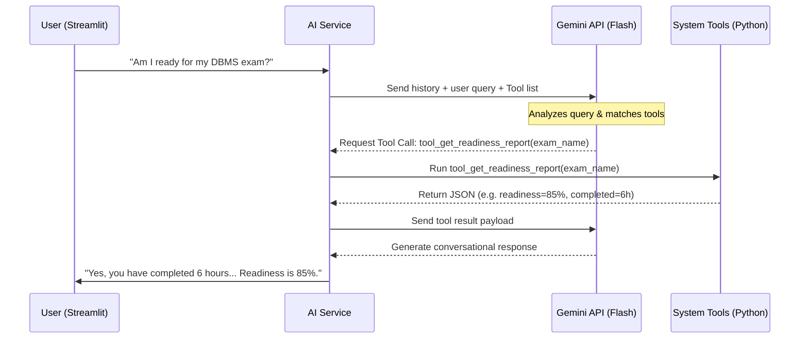

# AI Agent System Documentation

The Smart Timetable AI uses a natural language chat interface that acts as an autonomous calendar and task coordinator. 

---

## 1. Engine & Model

- **Core Model:** `gemini-2.5-flash`
- **Fallback Model:** `gemini-flash-latest`

To ensure high availability and prevent application crashes due to Google API rate limits or quota exhaustion, the system implements an **instantaneous exception-triggered fallback routine**. If a query to `gemini-2.5-flash` fails or triggers an overloaded/quota warning, the client immediately switches to `gemini-flash-latest` for the remainder of the session.

---

## 2. Agent System Instructions

The model is configured with a strict system prompt located in `app/prompts/system_prompts.py`. The instructions ensure that:
1. The model acts as an **efficient academic timetable assistant**.
2. The model relies **strictly on facts** obtained through the provided tools. It is explicitly forbidden from inventing user IDs, dates, assignments, or calendar events.
3. The model maintains a professional and encouraging student advisor persona.

---

## 3. Tool Declarations & Native Function Calling

The agent binds Python backend methods to the LLM via native function schemas in [app/services/ai_service.py](file:///c:/Users/SANJANA VADDEPALLY/AppData/Local/Packages/5319275A.WhatsAppDesktop_cv1g1gvanyjgm/LocalState/sessions/E0DF1368C0C56FE6B773093E6AF46E63796EA1B5/transfers/2026-24/_git 2/_git 2/app/services/ai_service.py).

The tools exposed to the agent include:
- `tool_get_calendar_events`: Retrieves the user's Google Calendar event schedule.
- `tool_schedule_event`: Schedules a specific study slot directly on the Google Calendar.
- `tool_get_assignments`: Lists all tracked assignments.
- `tool_get_exams`: Lists all upcoming exam registrations.
- `tool_get_study_progress`: Returns planned vs. completed study metrics.
- `tool_get_readiness_report`: Calculates readiness score analytics.
- `tool_get_free_slots_report`: Computes open slots directly.

---

## 4. Execution Workflow

