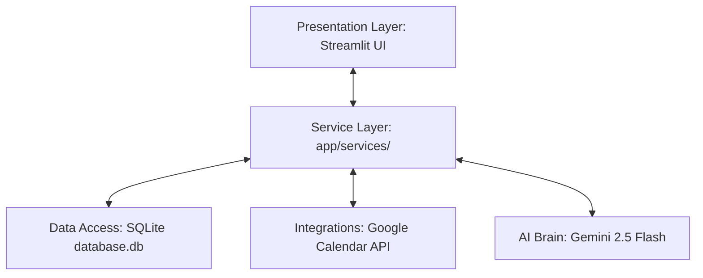
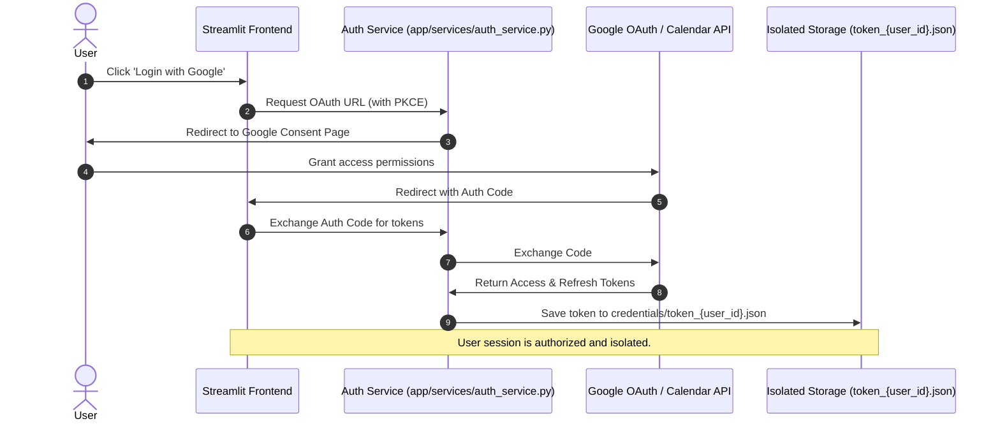
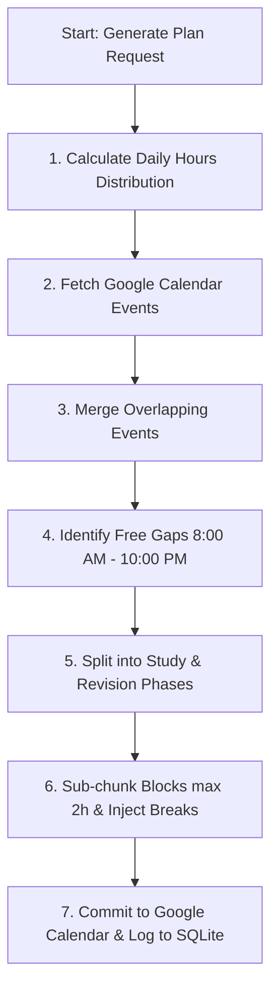

# System Architecture Documentation

The **Smart Timetable AI** application is built as an autonomous, multi-user scheduling assistant. It leverages Python, Streamlit, SQLite, and the Google Calendar API, orchestrated by the Gemini 2.5 Flash LLM with native function calling.

Below is the detail of the architecture, key design decisions, and core workflows.

---

## 1. High-Level Architectural Design

The system implements a decoupled **Service-Oriented MVC Architecture** which separates concerns across four distinct layers:



- **Presentation Layer (`app/routes/`):** Streamlit views (Dashboard, Timetable, Exams, Assignments, Chat/AI Assistant, Database Viewer) that capture user input and query state from the services to render tables, forms, and charts.
- **Service Layer (`app/services/`):** Autonomous business logic handlers (AI service, Google Authentication, Calendar interactions, Study scheduling planner, Exam progress) that do not directly import Streamlit.
- **Data Access Layer (`app/database/db.py`):** Encapsulates the SQLite connections, tables schema, and data access query code.
- **Integration Layer:** Connects to external interfaces (Google OAuth & Google Calendar REST API) and LLM endpoints (Gemini API with rate-limiting fallback).

---

## 2. Multi-Tenant User Isolation & Privacy Protection

To satisfy secure cloud and local deployment standards, the system isolates each user's state:

### Authentication & Token Flow
1. **Authentication Flow (Google Sign-In OAuth 2.0 Web Callback):**
   - The user clicks on Google sign-in.
   - The system initiates an authentication request with PKCE and redirects the user to Google.
   - The redirect callback parameters (`code` and `state` containing the `user_id` or action type) are captured by Streamlit's URL parameter parser.
   - The access/refresh token credentials returned by Google are parsed and saved to user-isolated token files: `credentials/token_{user_id}.json`.



### Data-Level Segregation (SQLite isolation)
- The `users` table assigns a unique identifier (`id`) to each registered email address.
- The tables `assignments`, `exams`, and `scheduled_sessions` all reference `user_id` as a foreign key:
  ```sql
  CREATE TABLE IF NOT EXISTS exams (
      id INTEGER PRIMARY KEY AUTOINCREMENT,
      user_id INTEGER REFERENCES users(id),
      subject TEXT NOT NULL,
      exam_date TEXT NOT NULL,
      syllabus TEXT,
      preparation_hours REAL DEFAULT 5.0
  );
  ```
- Every database lookup, insertion, and deletion runs with explicit filter clauses containing the active user's ID (`WHERE user_id = ?`).

---

## 3. Conflict Resolution & Auto-Scheduling Algorithm

The core scheduling engine ([planner_service.py](file:///c:/Users/SANJANA VADDEPALLY/AppData/Local/Packages/5319275A.WhatsAppDesktop_cv1g1gvanyjgm/LocalState/sessions/E0DF1368C0C56FE6B773093E6AF46E63796EA1B5/transfers/2026-24\_git 2\_git 2\app\services\planner_service.py)) translates an exam's `preparation_hours` into structured calendar entries without colliding with pre-existing events.



### Step-by-Step Logic:

1. **Weight Distribution:**
   Rather than spacing sessions uniformly, the algorithm applies an **ascending weight distribution** (closer to the exam, study density increases) to model optimal human preparation cycles:
   $$\text{Weight}_i = i \quad (\text{where } i \text{ is the day index from 1 to } N)$$
   $$\text{Daily Hours}_i = \text{Total Hours} \times \left(\frac{\text{Weight}_i}{\sum_{j=1}^{N} \text{Weight}_j}\right)$$

2. **Calendar Gap Analysis (Conflict Free Search):**
   - The system fetches up to 100 upcoming calendar events from Google Calendar for the logged-in user.
   - It filters and sorts these events by start time, and merges any overlapping events to build clear occupied time ranges.
   - It scans the remaining gaps day-by-day strictly within defined bounds (8:00 AM to 10:00 PM) to find free time slots of at least 30 minutes.

3. **Sub-chunking & Breaks:**
   - Free slots are split into focused study blocks of maximum 2 hours to prevent student burnout.
   - The algorithm automatically injects a mandatory 15-minute break between consecutive study blocks if the gap permits.
   - The study blocks are dynamically divided into *Study* (initial 70% of prep hours) and *Revision* (final 30% of prep hours) phases.

4. **Rollover Handling:**
   If a day has too many pre-existing commitments and cannot support the allocated prep hours, the unscheduled hours are rolled over to the next day's pool.

5. **Commitment & Local Synchronization:**
   Upon user approval, the service registers the event blocks directly to the Google Calendar API and simultaneously records logs in the local SQL database table (`scheduled_sessions`) for offline analytical processing.

---

## 4. AI Assistant & Tool Calling Architecture

The chatbot utilizes the **Gemini 2.5 Flash** model with custom configurations and tool integration:

- **Resilient Fallback Scheme:** When rate limits, quota limits, or server errors occur during calls to `gemini-2.5-flash`, the connection dynamically falls back to the `gemini-flash-latest` model.
- **Native Tool Calling:** In [app/services/ai_service.py](file:///c:/Users/SANJANA VADDEPALLY/AppData/Local/Packages/5319275A.WhatsAppDesktop_cv1g1gvanyjgm/LocalState/sessions/E0DF1368C0C56FE6B773093E6AF46E63796EA1B5/transfers/2026-24\_git 2\_git 2\app\services\ai_service.py), python methods (such as scheduling, querying assignments/exams, checking readiness score, or viewing free blocks) are compiled into JSON declarations.
- **Execution Loop:**
  1. The LLM receives the chat history, current time context, and the tool definitions.
  2. The LLM determines if a tool execution is needed (e.g. user asks "Am I ready for my DBMS exam?").
  3. The LLM returns a structured tool call response.
  4. The python runtime intercepts this, runs the corresponding local python method, captures the JSON output, and returns it to the LLM.
  5. The LLM reads the result and formats a conversational answer.
